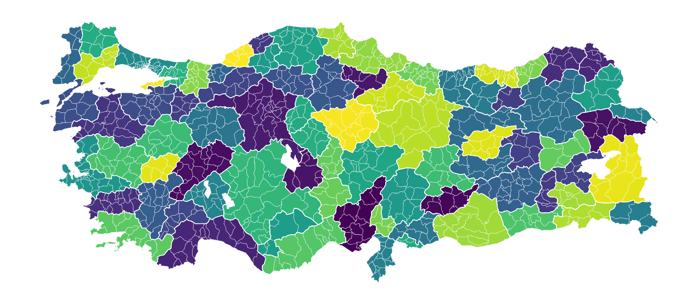

# turkiye

Python helpers for plotting Türkiye administrative boundaries and resolving
province/district identities.

The package bundles Türkiye ADM2 district boundaries, derives province
boundaries from them, and subtracts major lake polygons from the default map so
large inland waters are not colored as part of an administrative division.

## Install

```bash
pip install turkiye
```

## District Map

Data can identify districts with `il` and `ilce` columns. Turkish characters
and ASCII spellings are both accepted for matching, so `ÇANAKKALE` and
`CANAKKALE` point to the same province. Central districts can be matched by
either their district name or `MERKEZ`, so Şırnak's central district accepts
both `SIRNAK` and `MERKEZ`.



```python
from turkiye import load_boundaries, plot

districts = load_boundaries("ilce")[["il", "ilce"]]
districts["example_value"] = range(1, len(districts) + 1)

ax = plot(
  districts,
  level="ilce",
  color="example_value",
  label="Example value",
  backend="matplotlib",
)
```

Set `backend="matplotlib"` for static maps like the one above.

## Plotting Backends

Use `plot()` with `backend="plotly"` for interactive maps or
`backend="matplotlib"` for static Matplotlib output. The explicit
`plot_interactive()` and `plot_static()` helpers are available when you want to
call a backend directly.

```python
import pandas as pd

from turkiye import plot, plot_interactive, plot_static

province_values = pd.DataFrame(
  {"value": [1, 2]},
  index=pd.Index(["ANKARA", "ISTANBUL"], name="il"),
)

interactive_fig = plot(province_values, color="value")
same_interactive_fig = plot_interactive(province_values, color="value")

static_ax = plot(province_values, backend="matplotlib", color="value")
same_static_ax = plot_static(province_values, color="value")
```

For static output:

```python
ax = plot(province_values, backend="matplotlib", color="value")
```

## Boundary Data

```python
from turkiye import load_boundaries

provinces = load_boundaries("il")
districts = load_boundaries("ilce")
```

The default bundled source supports `il` and `ilce`. Province geometries are
derived by dissolving the bundled district layer. `belde` and `mahalle`
identities can be resolved where historical metadata exists, but bundled
geometry falls back to the nearest available district geometry.

Boundary frames include `il_aliases` and `ilce_aliases` columns for inspection.
Plot joins use those aliases automatically: matching is case-insensitive,
Turkish/ASCII-insensitive, and central districts accept both their province
name and `MERKEZ`.
